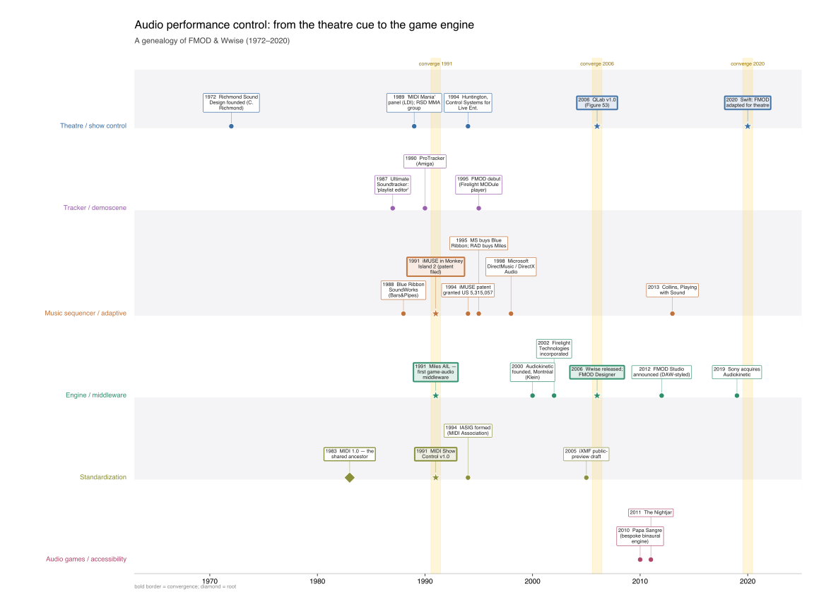

## Swim-lane timeline

The timeline is built from `timeline_data.json` (edit data there, not here) by
`make_timeline.py` (matplotlib) or `timeline.vl.json` (Vega-Lite). Embed the vector SVG:

{width=100%}

## Genealogy graph

Rendered natively by Quarto/Graphviz for **both** HTML and PDF (kept in sync with `genealogy.dot`):

```{dot}
//| label: fig-genealogy
//| fig-cap: "Siblings descended from MIDI — not parent→child."
digraph g {
  rankdir=TB; node [shape=box style="rounded,filled" fontname=Helvetica fontsize=10 color="#888"];
  edge [fontname=Helvetica fontsize=8 color="#666" arrowsize=0.7];
  midi [label="MIDI 1.0 (1983)" shape=oval fillcolor="#ffe9a8"];
  rsd [label="Richmond Sound Design (1972)\nStage Manager (1991)" fillcolor="#dce8f5"];
  msc [label="MIDI Show Control (1991)" fillcolor="#dce8f5"];
  qlab [label="QLab (2006) · SFX · SCS" fillcolor="#dce8f5"];
  trk [label="Ultimate Soundtracker (1987)\n'playlist editor'" fillcolor="#f4e2d2"];
  imuse [label="iMUSE (1991) US 5,315,057" fillcolor="#ecdcf2"];
  dmus [label="DirectMusic" fillcolor="#ecdcf2"];
  miles [label="Miles AIL (1991)" fillcolor="#d6ece2"];
  fmod [label="FMOD (1995→2012)" fillcolor="#d6ece2"];
  wwise [label="Wwise / Audiokinetic (2006)" fillcolor="#d6ece2"];
  ixmf [label="IASIG / iXMF (1994)" shape=oval fillcolor="#fff3cf"];
  swift [label="★ Swift (2020): FMOD→theatre\nevent≈cue · scatterer≈QLab group cue" shape=note fillcolor="#ffd24d"];
  midi->rsd; rsd->msc; msc->qlab; midi->imuse [style=dashed]; imuse->dmus [style=dotted];
  trk->fmod; miles->fmod [style=dotted]; imuse->wwise [style=dotted]; dmus->wwise [style=dotted];
  midi->ixmf; imuse->ixmf [label="Land+Sanger"]; msc->ixmf [style=dashed color="#9a7400" label="parallel MMA standards"];
  qlab->swift [color="#9a7400"]; fmod->swift [color="#9a7400"];
}
```

## Notes

- Four lineages feed modern game-audio middleware; only one (theatre/show-control) is theatrical.
- Convergence moments: **1991** (MSC + Miles + iMUSE), **2006** (Wwise + QLab), **2020** (Swift).
- Sources: Zotero collection **CLAUDE_AUDIOGAMES** (41 items, 5 thematic sub-collections).
